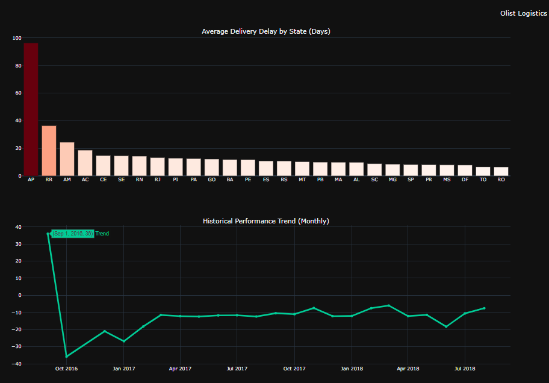
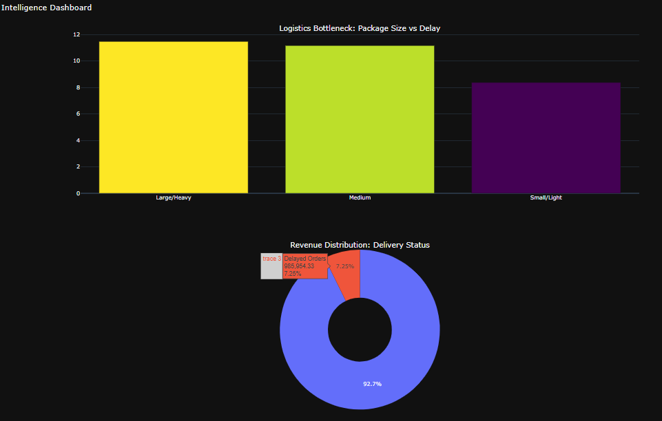

## 🚚   Logistics E-C Pipeline - Python - Postgre - Docker

Basic Data Engineering project that analyzes logistics performance for Brazilian e-commerce.
This project implements an automated ETL pipeline, creates a specialized Data Warehouse layer (SQL Views), and delivers actionable business insights via an interactive **Dashboard**.

### Project Overview & Dashboard
The system identifies logistics bottlenecks, calculates financial losses due to delays, and visualizes shipping trends across 27 states.







* Database: PostgreSQL 15 
* ETL & Data Manipulation: Pandas, SQLAlchemy
* Visualization: Plotly 
* Containerization: Docker & Docker Compose

##  Key Features


1.  **Automated ETL Pipeline**:
    * Ingests 5 raw CSV datasets (~100k records).
    * Performs data cleaning and type casting (Temporal data handling).
    * Loads data into a normalized PostgreSQL schema.

2.  **Analytical Layer (SQL Views)**:
    * Instead of complex joins in Python, a persistent logistics_master_table View was created in the database.
    * This acts as a "Single Source of Truth" for all downstream analytics.

3.  **Business Intelligence**:
    * **Route Analysis**: Identifies worst-performing origin-destination pairs.
    * **Financial Impact**: Calculates revenue at risk due to shipping delays.
    * **Interactive Dashboard**: A 2x2 Plotly grid showing spatial, temporal, and financial metrics.

### Data donwloaded from kaggle: https://www.kaggle.com/datasets/olistbr/brazilian-ecommerce/data


###  Start the Database
Spin up the PostgreSQL container using Docker:
```bash
docker-compose up -d